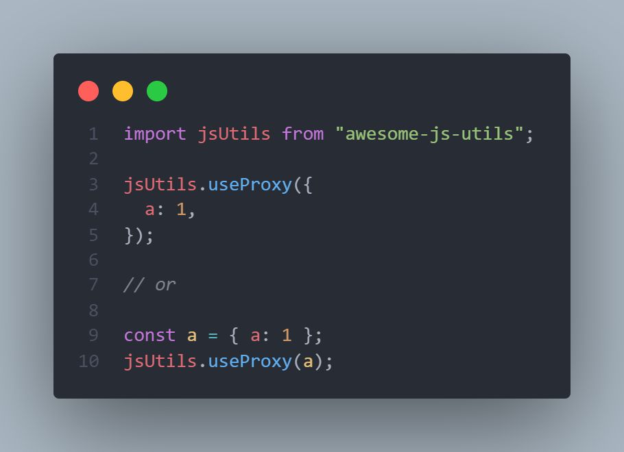

# Javascript Utils.

| Util          | Link  | description |
| ------------- |:-------------:|:-------------:|
| useProxy     | https://github.com/yashwanthkorla/js-utils/blob/main/src/useProxy | Used to replace undefined with some value when the key is not present in the object
| sortObject | https://github.com/yashwanthkorla/js-utils/blob/main/src/sortObject | used to sort out the object by key and value either ascending or descending.
| isArrayNotEmpty | https://github.com/yashwanthkorla/js-utils/blob/main/src/isArrayNotEmpty | util to check whether the variable passed is valid array and has some length
| isObjectNotEmpty | https://github.com/yashwanthkorla/js-utils/blob/main/src/isObjectNotEmpty | util to check whether the variable passed is valid object and has some properties in it.
| removeDuplicatesFromArray | https://github.com/yashwanthkorla/js-utils/blob/main/src/removeDuplicatesFromArray | util to remove duplicates from array. Array can be of any time either only one data type or it can be array of many data types.

## Using npm

````bash
npm i awesome-js-utils
````

## Usage

